```{r setup, echo=F, purl=F}
knitr::opts_knit$set(root.dir = getwd())
knitr::opts_chunk$set(echo = TRUE, results = 'hide')
knitr::opts_chunk$set(warning = FALSE, message=FALSE)
knitr::opts_chunk$set(fig.align="center"
                      ## ,out.width="0.9\\textwidth" # latex
                      ,out.width="80%" # for both latex and html
                      ,fig.width=5, fig.height=3
                      )
```

```{r prepare, echo=F, purl=F}
rm(list=ls())
options(digits=4)
options(scipen=100)
graphics.off()
Sys.setlocale("LC_ALL", "Chinese")
library(reticulate)
```

# 四格表

### 吸烟对肺癌影响

例: 吸烟对肺癌有没有影响

1927年英国医生泰勒哥德博士观察到肺癌患者中吸烟者比例很高；

试验：观察到数据

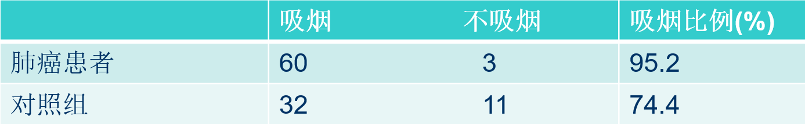{width=500px}

### 吸烟对肺癌影响

上例问题的粗象化

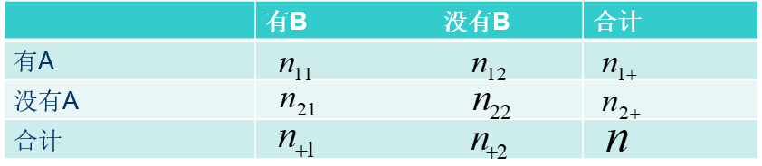{width=500px} 

### 四格表的抽样方式

四格表边际中有5个数：  ${n_{1 + }},{n_{2 + }},{n_{ + 1}},{n_{ + {\rm{2}}}}, n$ 

有以下4中不同抽样方式：

1. 总的样本容量  $n$  未给定，
   ${n_{1{\rm{1}}}},{n_{{\rm{1}}2}},{n_{{\rm{2}}1}},{n_{{\rm{22}}}}$  完全随机
2. 总的样本容量  $n$  给定， ${n_{1{\rm{1}}}},{n_{{\rm{1}}2}},{n_{{\rm{2}}1}},{n_{{\rm{22}}}}$  中有三个是r.v.
3. ${n_{1 + }},{n_{2 + }}$  给定，四格表中四个数，两个是r.v.例如 ${n_{1{\rm{1}}}},{n_{2{\rm{1}}}}$  是随机变量，且互相独立；
4. 两侧都给定，
   ${n_{1{\rm{1}}}},{n_{{\rm{1}}2}},{n_{{\rm{2}}1}},{n_{{\rm{22}}}}$  只有一个是
   随机变量
   
### 孟德尔豌豆试验

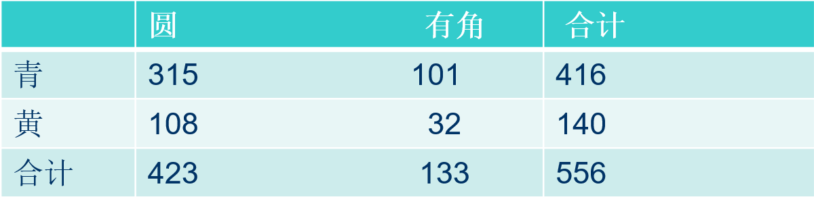{width=500px} 

### 顾客性别以及是否购买服装

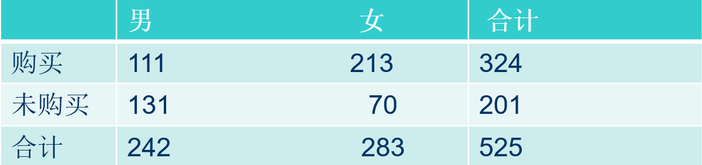{width=500px}

### 品酒

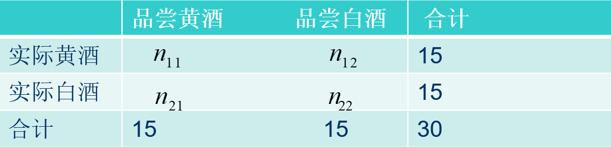{width=500px}

### 四格表中抽样方式很重要

吸烟和不吸烟的人中肺癌患者比例

{width=500px}

### 独立与不相关

对正态分布来说，独立与不相关等价；

对四格表来说，独立与不相关等价。

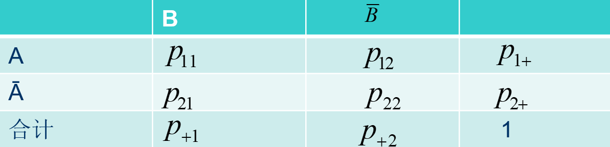{width=500px}

### 独立与不相关

A、B互相独立：
\[ \Leftrightarrow {p_{11}} = {p_{1 + }}{p_{ + 1}} \Leftrightarrow {p_{1{\rm{2}}}} = {p_{1 + }}{p_{ + {\rm{2}}}}\]
\[ \Leftrightarrow {p_{{\rm{21}}}} = {p_{{\rm{2}} + }}{p_{ + {\rm{1}}}} \Leftrightarrow {p_{{\rm{22}}}} = {p_{{\rm{2}} + }}{p_{ + {\rm{2}}}}\]

只需要其中一个成立！

### 独立与不相关

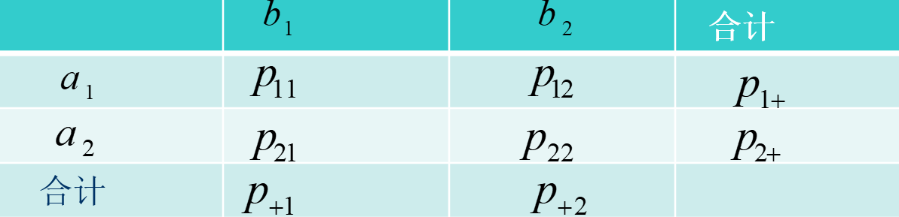{width=500px}

A、B不相关：
\[ \Leftrightarrow {p_{11}} = {p_{1 + }}{p_{ + 1}}\Leftrightarrow {p_{1{\rm{2}}}} = {p_{1 + }}{p_{ + {\rm{2}}}}\]
\[ \Leftrightarrow {p_{{\rm{21}}}} = {p_{{\rm{2}} + }}{p_{ + {\rm{1}}}} \Leftrightarrow {p_{{\rm{22}}}} = {p_{{\rm{2}} + }}{p_{ + {\rm{2}}}}\]
此时，独立与不相关等价！相关系数与变量赋值无关！

## 单侧给定时四格表的检验问题

单侧给定，例如  ${n_{1 + }},{n_{2 + }}$  给定后，
 ${n_{1{\rm{1}}}},{n_{2{\rm{1}}}}$  分别独立地服从二项分布 
\[b({n_{1 +}},{p_1}),b({n_{2 + }},{p_2})\] ，
其中  ${p_1} = P(B\left| A \right.),{p_2} =
P(B\left| {\bar A} \right.)$ 

要检验“在总体中，肺癌患者吸烟比例是否比对照组中吸烟比例高”等价于检验假设

\[{H_0}:{p_1} = {p_2} \leftrightarrow {H_1}:{p_1} > {p_2}\]

由推导式 \[\frac{{{p_{11}}}}{{{p_{1 + }}}} = \frac{{{p_{21}}}}{{{p_{2 + }}}} = \frac{{{p_{11}} + {p_{21}}}}{{{p_{1 + }} + {p_{2 + }}}} = {p_{ + 1}}\]

知原假设成立时，A、B独立。

### 单侧给定时检验统计量的选择

${p_1}$  与  ${p_{\rm{2}}}$  极大似然估计为：

\[{\hat p_1} = \frac{{{n_{11}}}}{{{n_{1 + }}}},{\hat p_2} = \frac{{{n_{21}}}}{{{n_{2 + }}}}\]

由中心极限定理，我们有：

\[\frac{{{{\hat p}_1} - {p_1}}}{{\sqrt {{p_1}(1 - {p_1})/{n_{1 + }}} }}N(0,1)\]

\[\frac{{{{\hat p}_2} - {p_2}}}{{\sqrt {{p_2}(1 - {p_2})/{n_{2 + }}} }}N(0,1)\]

### 单侧给定时检验统计量的选择

由独立性

\[\frac{{{{\hat p}_1}{\rm{ - }}{{\hat p}_2} - ({p_1} - {p_2})}}{{\sqrt {{p_1}(1 - {p_1})/{n_{1 + }} + {p_2}(1 - {p_2})/{n_{2 + }}} }}\sim N(0,1)\]

原假设成立时有：

\[\frac{{{{\hat p}_1}{\rm{ - }}{{\hat p}_2}}}{{\sqrt {(1/{n_{1 + }} + 1/{n_{2 +
}})p(1 - p)} }}\sim N(0,1)\]

### 单侧给定时检验统计量的选择

由于  $p$  未知，需要代人估计量(pooled estimate)

故选择统计量

\[{\rm{U}} = \frac{{{{\hat p}_1}{\rm{ - }}{{\hat p}_2}}}{{\sqrt {(1/{n_{1 + }} + 1/{n_{2 + }})\hat p(1 - \hat p)} }}N(0,1)\]

其中 \[\hat p = \frac{{{n_{ + 1}}}}{n}\] 为pooled estimate.

### 连续修正

二项分布的连续修正

当 $n$ 充分大时 \[X \sim B(n,p)\]

\[P(X \le k) \approx \Phi \left( {\frac{{k - np}}{{\sqrt {np(1 - p)} }}}
\right)\]

\[P(X \le k) = P(X < k + 1) \approx \Phi \left( {\frac{{k + 1 - np}}{{\sqrt
{np(1 - p)} }}} \right)\]

### 连续修正

英国统计学家Yates(1934)提出一个修正

\[P(X \le k) \approx \Phi \left( {\frac{{k + {\rm{1/2}} - np}}{{\sqrt {np(1 - p)} }}} \right)\]

相当于
   
\[X\mathop \sim \limits^N(np,np(1 - p)) \Rightarrow X + 1/2\mathop \sim \limits^N(np,np(1 - p))\]

### 连续修正
   
从而有

\[P(X < k) \approx \Phi \left( {\frac{{k - 1/2 - np}}{{\sqrt {np(1 - p)} }}}
\right)\]

\[P(X \ge k) = 1 - P(X < k) \approx 1 - \Phi \left( {\frac{{k - 1/2 -
np}}{{\sqrt {np(1 - p)} }}} \right) = \Phi \left( {\frac{{np - k + 1/2}}{{\sqrt
{np(1 - p)} }}} \right)\]

\[P(X > k) = P(X \ge k + 1) \approx \Phi \left( {\frac{{np - k - 1/2}}{{\sqrt
{np(1 - p)} }}} \right)\]


## 单侧给定时四格表独立性检验的似然比检验

似然比为：

\[\Lambda  = \frac{{Sup({p^{{n_{1 + }}}}{{(1 - p)}^{{n_{ + 2}}}}}}{{\mathop
{Sup}\limits_{{p_1} \cdots {p_r}} (p_1^{{n_{11}}}{{(1 -
{p_1})}^{{n_{12}}}}p_2^{{n_{21}}}{{(1 - {p_2})}^{{n_{22}}}})}} =
\prod\nolimits_{i = 1}^2 {\prod\nolimits_{j = 1}^2 {{{\left( {\frac{{{n_{i +
}}{n_{ + j}}}}{{n{n_{ij}}}}} \right)}^{{n_{ij}}}}} } \]

### 单侧给定时四格表独立性检验的似然比检验

原假设成立时  $\Lambda$  的值接近于0且

\[ - 2\ln \Lambda  =  - 2\sum\limits_{i = 1}^2 {\sum\limits_{j = 1}^2 {{n_{ij}}\ln \left( {\frac{{{n_{i + }}{n_{ + j}}}}{{{n_{ij}}n}}} \right)} } \sim {\chi ^2}(1)\]

与卡方统计量自由度相同。

### 吸烟对肺癌有没有影响
 ${\chi ^{\rm{2}}}$  检验统计量 
\[{\chi ^{\rm{2}}} = \frac{{n{{({n_{11}}{n_{22}} - {n_{12}}{n_{21}})}^2}}}{{{n_{1 + }}{n_{2 + }}{n_{ + 1}}{n_{ + 2}}}} = 9.664\]

修正的  ${\chi ^{\rm{2}}}$  检验统计量
\[{\chi ^{\rm{2}}} = \frac{{n{{(\left| {{n_{11}}{n_{22}} - {n_{12}}{n_{21}}}
\right| - n/2)}^2}}}{{{n_{1 + }}{n_{2 + }}{n_{ + 1}}{n_{ + 2}}}} = 7.933\]
\[{\rm{ - 2}}\ln \Lambda  =  - 2\left[ {60\ln \left(
{\frac{{63}}{{106}}\frac{{92}}{{60}}} \right) +  \cdots  + 11\ln \left(
{\frac{{43}}{{106}}\frac{{14}}{{11}}} \right)} \right]= 9.722\]

### 当四格表中出现0

由于当  $x > 0$  时，且  $x \to 0$  ， $x\ln x \to 0$ 

因此，当四格表中有观察值0时，可以相应的将似然比统计量中的这一项换成0

或者将表格中每个频数增加一个很小的正常量

# 总体样本容量给定时四格表的检验问题

## 条件方法和无条件方法

- 条件检验法

总体样本容量n给定后

\[({n_{11}},{n_{12}},{n_{21}},{n_{22}}) \sim M(n,{p_{11}},{p_{12}},{p_{21}},{p_{22}})\]

再使用上节中单侧给定时的检验方法。

- 无条件检验法 

应用分类数据的检验方法，仅考虑无方向情形，即独立性检验。

### 样本容量给定时条件方法

可以使用单侧给定条件下的检验方法原因：

若
\[({n_{11}},{n_{12}},{n_{21}},{n_{22}}) \sim M(n,{p_{11}},{p_{12}},{p_{21}},{p_{22}})\]
则在单侧  ${n_{1 + }}$  和  ${n_{2 + }}$  给定后， ${n_{11}}$  和  ${n_{21}}$ 
分别独立地服从二项分布 \[b({n_{1 + }},{p_1}), b({n_{{\rm{2}} + }},{p_{\rm{2}}})\]

这是因为
\[({n_{11}},{n_{12}},{n_{21}},{n_{22}}) \sim M(n,{p_{11}},{p_{12}},{p_{21}},{p_{22}})\]

\[{\frac{{n!}}{{{n_{11}}!{n_{12}}!{n_{21}}!{n_{22}}!}}p_{11}^{{n_{11}}}p_{12}^{{n_{12}}}p_{21}^{{n_{21}}}p_{22}^{{n_{22}}}}\]
        
### 样本容量给定时条件方法

 $({n_{1 + }},{n_{2 + }})$  的边际分布律为 
\[\frac{{n!}}{{{n_{1 + }}!{n_{2 + }}!}}p_{1 + }^{{n_{1 + }}}p_{2 + }^{{n_{2 +
}}}\]

从而  ${n_{1 + }}$  和  ${n_{2 + }}$  给定后， $({n_{11}},{n_{12}},{n_{21}},{n_{22}})$  的条件分布为
\[\left( {\frac{{{n_{{\rm{1}} +
}}!}}{{{n_{1{\rm{1}}}}!{n_{{\rm{1}}2}}!}}p_1^{{n_{1{\rm{1}}}}}{{(1 -
{p_1})}^{{n_{12}}}}} \right)\left( {\frac{{{n_{{\rm{2}} +
}}!}}{{{n_{2{\rm{1}}}}!{n_{{\rm{2}}2}}!}}p_2^{{n_{2{\rm{1}}}}}{{(1 -
{p_2})}^{{n_{22}}}}} \right)\]

### 样本容量给定时无条件方法

使用分类数据的检验方法
\[({n_{11}},{n_{12}},{n_{21}},{n_{22}}) \sim M(n,{p_{11}},{p_{12}},{p_{21}},{p_{22}})\]
\[{H_0}:{p_{ij}} = {p_{i + }}{p_{ + j}},\] 
对所有的  $i,j = 1,2$  都成立
 ${H_{\rm{1}}}$  存在 $i$ 和 $j$ ，使得 
\[{p_{ij}} \ne {p_{i + }}{p_{ + j}}\]
构造带参数的分类数据卡方检验统计量：
\[{\chi ^{\rm{2}}} = \sum\limits_{i = 1}^2 {\sum\limits_{j = 1}^2
{\frac{{{{\left( {{n_{ij}} - n{{\hat p}_{ij}}} \right)}^2}}}{{n{{\hat
p}_{ij}}}}} } \]

### 样本容量给定时无条件方法

将原假设下  ${p_{ij}}$  的极大似然估计代人，经过代数运算得：
\[{\chi ^{\rm{2}}} = \frac{{n{{\left( {{n_{11}}{n_{22}} - {n_{12}}{n_{21}}} \right)}^2}}}{{{n_{1 + }}{n_{1 + }}{n_{ + 1}}{n_{ + 2}}}}\]
总体样本量给定时和单侧给定时给出的公式一样；

也可以对上面统计量给出连续性修正统计量。

## 样本容量给定时四格表独立性检验的似然比检验

带参数的分类数据的似然比检验统计量为
\[ - 2\ln \Lambda  =  - 2\sum\limits_{i = 1}^2 {\sum\limits_{j = 1}^2 {{n_{ij}}\ln \left( {\frac{{{{\hat p}_{ij}}}}{{{n_{ij}}n}}} \right)} } \]
将  ${p_{ij}}$  的极大似然估计代人上式有
\[ - 2\ln \Lambda  =  - 2\sum\limits_{i = 1}^2 {\sum\limits_{j = 1}^2
{{n_{ij}}\ln \left( {\frac{{{n_{i + }}{n_{ + j}}}}{{{n_{ij}}n}}} \right)} } \sim {\chi ^2}(1)\]

### 样本容量给定时四格表独立性检验的似然比检验

样本容量给定时和单侧给定时四格表独立性检验的似然比检验相同。

例3.4 性别和导致死亡的结核病类型关系  ${\chi ^{\rm{2}}}$  统计量
\[ = \frac{{n{{\left( {{n_{11}}{n_{22}} - {n_{12}}{n_{21}}} \right)}^2}}}{{{n_{1
+ }}{n_{1 + }}{n_{ + 1}}{n_{ + 2}}}}\]
\[ = \frac{{{\rm{3583}}{{\left( {{\rm{2356}} \times {\rm{168 - 180}} \times
{\rm{879}}} \right)}^{\rm{2}}}}}{{{\rm{2536}} \times {\rm{1047}} \times
{\rm{3235}} \times {\rm{348}}}} = {\rm{67}}{\rm{.6622}}\]

### 例 3.4 似然比统计量

似然比统计量

\[ - 2\ln \Lambda  =  - 2\sum\limits_{i = 1}^2 {\sum\limits_{j = 1}^2
{{n_{ij}}\ln \left( {\frac{{{n_{i + }}{n_{ + j}}}}{{{n_{ij}}n}}} \right)} } \]

\[{ = {\rm{ - 2}}\left( {{\rm{2356}}\ln \frac{{3235*2536}}{{3583*2356}} +
\cdots  + {\rm{168}}\ln \frac{{348*1047}}{{3583*168}}} \right) = 62.4413}\]

# 完全随机时四格表的检验问题

完全随机时，四格表推断依据是假设  $({n_{11}},{n_{12}},{n_{21}},{n_{22}})$ , 分别
队列地服从泊松分布，即
\[{n_{ij}} \sim P({\lambda _{ij}})\]

结论：若 ${n_{ij}} \sim P({\lambda _{ij}})i,j = 1,2$ ，并且它们互相独立，则当 $n
= {n_{11}} + {n_{12}} + {n_{21}} + {n_{22}}$ 给定时，
\[({n_{11}},{n_{12}},{n_{21}},{n_{22}}) \sim M(n,{p_{11}},{p_{12}},{p_{21}},{p_{22}})\]

## 完全随机时四格表的检验问题

$n$ 给定时，
\[({n_{11}},{n_{12}},{n_{21}},{n_{22}}) \sim M(n,{p_{11}},{p_{12}},{p_{21}},{p_{22}})\]
其中

\[{p_{ij}} = \frac{{{\lambda _{ij}}}}{{{\lambda _{11}} + {\lambda _{12}} + {\lambda _{21}} + {\lambda _{22}}}},i,j = 1,2\]
计算条件分布可以得到结论。

# 四格表的费歇尔精确检验

前面使用到的统计量均是渐近统计量，因此要求样本量比较大，效果才好；

当样本量比较小时，需要考虑精确分布；

费歇尔精确检验方法，可视为单侧给定时假设另一单侧也给定的条件方法。

### 四格表的费歇尔精确检验

四格表单侧给定

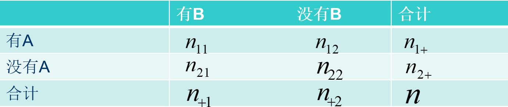{width=500px}

### 四格表的费歇尔精确检验

单侧给定，例如  ${n_{1 + }},{n_{2 + }}$  给定后，
 ${n_{1{\rm{1}}}},{n_{2{\rm{1}}}}$  分别独立地服从二项分布 
\[b({n_{1 + }},{p_1}),b({n_{2 + }},{p_2})\] ，其中 \[{p_1} = P(B\left| A \right.),{p_2} = P(B\left| {\bar A} \right.)\]
检验问题为：
\[{H_0}:{p_1} = {p_2} \leftrightarrow {H_1}:{p_1} > {p_2}\]

用 ${n_{11}}$  作检验统计量，因此需要考虑原假设成立条件下， ${n_{11}}$  的分布
事实上，如果假定另一侧也给定，原假设成立时， ${n_{11}}$服从超几何分布(精确！)

### 四格表的费歇尔精确检验

原理：若  $X \sim b({n_{1 + }},p),Y \sim b({n_{2 + }},p)$  则在  $X + Y = n$  的条件下
\[P(X = {n_{11}}|X + Y = {n_{ + 1}})\]
\[ = \frac{{P(X = {n_{11}},Y = {n_{21}})}}{{P(X + Y = {n_{ + 1}})}}\]
\[ = \frac{{\left( {\begin{array}{*{20}{c}}
{{n_{1 + }}}\\
{{n_{11}}}
\end{array}} \right){p^{{n_{11}}}}{{(1 - p)}^{{n_{12}}}}\left( {\begin{array}{*{20}{c}}
{{n_{2 + }}}\\
{{n_{21}}}
\end{array}} \right){p^{{n_{21}}}}{{(1 - p)}^{{n_{22}}}}}}{{\left( {\begin{array}{*{20}{c}}
n\\
{{n_{ + 1}}}
\end{array}} \right){p^{{n_{ + 1}}}}{{(1 - p)}^{{n_{ + 2}}}}}}\]

\[ = \frac{{\left( {\begin{array}{*{20}{c}}
{{n_{1 + }}}\\
{{n_{11}}}
\end{array}} \right)\left( {\begin{array}{*{20}{c}}
{{n_{2 + }}}\\
{{n_{21}}}
\end{array}} \right)}}{{\left( {\begin{array}{*{20}{c}}
n\\
{{n_{ + 1}}}
\end{array}} \right)}}\]

### 两侧给定时的四格表检验

故可以认为 $n_{11}$ 比较大时拒绝原假设，即认为 $p_1>p_2$
对给定的显著性水平$\alpha$，临界值 $c$ 满足：
\[P({n_{11}} \ge c) \le \alpha \]

且 $c$ 应尽可能的小。即
\[c = \inf \{ {c^*}:P({n_{11}} \ge {c^*}) \le \alpha \} \]

### 两侧给定时的四格表检验

当备择假设为 $p_1<p_2$ 时，可以认为 $n_{11}$ 比较小就拒绝原假设。
临界值满足：
\[P({n_{11}} \le d) \le \alpha \]

且 $d$ 应尽可能大。即
\[d = \sup \{ {d^*}:P({n_{11}} \le {d^*}) \le \alpha \} \]

当备择假设为 $p1\neq p2$ 时，拒绝域为：
\[{n_{11}} \le d{n_{11}} \ge c\]

### 两侧给定时的四格表检验

通常精确检验的解法是，首先计算检验的 $P$ 值，然后给出结论。当备择假设不同时， $P$ 值的计算有所不同；

备择假设 $p1>p2$ ，
\[p = P(HG(n,{n_{ + 1}},{n_{1 + }}) \ge {n_{11}})\]

备择假设 $p1<p2$ ，
\[p = P(HG(n,{n_{ + 1}},{n_{1 + }}) \le {n_{11}})\]

备择假设 $p1\neq p2$ （无方向检验），当 $n_{11}$ 比较大时，

\[p = {p_1} + P(HG(n,{n_{ + 1}},{n_{1 + }}) \le a)\]
\[{p_1} = P(HG(n,{n_{ + 1}},{n_{1 + }}) \ge {n_{11}}),\]
\[a = \sup \left\{ {{a^*}:P(HG(n,{n_{ + 1}},{n_{1 + }}) \le {a^*}) \le {p_1}}
\right\}\]

### 两侧给定时的四格表检验

当 $n_{11}$ 比较小时，

\[p = {p_1} + P(HG(n,{n_{ + 1}},{n_{1 + }}) \ge a)\]
\[{p_1} = P(HG(n,{n_{ + 1}},{n_{1 + }}) \le {n_{11}}),\]
\[a = \inf \left\{ {{a^*}:P(HG(n,{n_{ + 1}},{n_{1 + }}) \ge {a^*}) \le {p_1}} \right\}\]

【例3.5】对肺癌与吸烟的问题例3.1进行费歇尔精确检验。

原题问的是肺癌患者吸烟的比例是否较高

### 两侧给定时的四格表

【解】检验的 $P$ 值为：

\[p = P(HG(106,92,63) \ge 60)\]
\[ = P(HG(106,92,63) = 60) + P(HG(106,92,63) = 61)\]
\[ + P(HG(106,92,63) = 62) + P(HG(106,92,63) = 63)\]
\[P(HG(106,92,63) = 60) = 0.002161\]
\[P(HG(106,92,63) = 61) = 0.000283\]
\[P(HG(106,92,63) = 62) = 0.000022\]
\[P(HG(106,92,63) = 63) = 0.00000074\]

故拒绝原假设，认为肺癌患者中吸烟比例高。
\[p = P(HG(106,92,63) \ge 60) = 0.002467\]

### 两侧给定时的四格表检验

【例3.6】对肺癌与吸烟的问题例3.1进行无方向的费歇尔精确检验。

【解】由于备择假设为无方向检验，且 $n_{11}$ 较大，故检验的 $P$ 值计算公式选用第一种情况，即

\[p = {p_1} + P(HG(106,92,63) \le a)\]
\[{p_1} = P(HG(106,92,63) \ge 60) = 0.002467,\]
\[a = \sup \left\{ {{a^*}:P(HG(106,92,63) \le {a^*}) \le 0.002467} \right\}\]
根据表3.1可知， $n_{11}$ 最小为49，因此令  ${a^*} = 49$  并得到：
\[P(HG(106,92,63) = 49) = 0.000353676 < 0.002467\]

### 两侧给定时的四格表检验

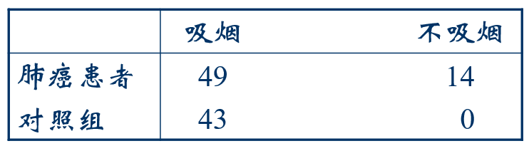{width=500px}

再令  ${a^*} = 50$  得到，
\[P(HG(106,92,63) = 50) = 0.004258264 > 0.002467\]
因此， $a = 49$  。检验的 $P$ 值应为：
\[p = 0.002467 + 0.000353676 = 0.002821\]
可见， $P$ 值很小，故应拒绝原假设，认为肺癌患者中吸烟
的比例与对照组中吸烟的比例不一致。

### 关于精确检验方法

- 费歇尔精确检验是视为单侧给定时假设另一侧也给定的条件检验方法；
- 也可以作为两侧都给定时的四格表检验方法；
- 还可以看作总的样本容量给定，以及完全随机情况下的检验方法。
- 可见，只要满足样本量小的条件，就可以加以运用。

## Mantel Haenszel $\chi^{2}$ 检验

(曼特尔-亨塞尔)检验是费歇尔精确检验在大样本时的渐近形式。

已知：
\[E({n_{11}}) = \frac{{{n_{1 + }}{n_{ + 1}}}}{n}D({n_{11}}) = \frac{{{n_{1
+ }}{n_{2 + }}{n_{ + 1}}{n_{ + 2}}}}{{{n^2}(n - 1)}}\]

则 $n_{11}$ 的标准化形式化简后为：
\[U = \frac{{\sqrt {n - 1} ({n_{11}}{n_{22}} - {n_{12}}{n_{21}})}}{{\sqrt {{n_{1
+ }}{n_{2 + }}{n_{ + 1}}{n_{ + 2}}} }}N01\]
\[{\chi ^2} = {U^2} = \frac{{(n - 1){{({n_{11}}{n_{22}} -
{n_{12}}{n_{21}})}^2}}}{{{n_{1 + }}{n_{2 + }}{n_{ + 1}}{n_{ + 2}}}} \sim {\chi
^2}1\]


### Mantel Haenszel $\chi^{2}$ 检验(曼特尔-亨塞尔)

那么，费歇尔精确检验在大样本时的渐进形式为：

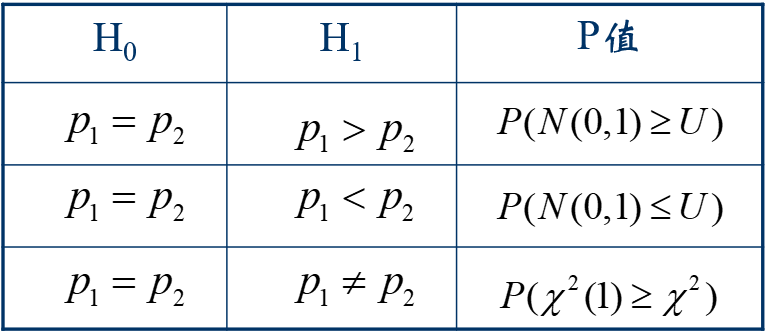{width=500px}

其中，把第三行的卡方检验特称为Mantel-Haenszel 卡方检验。

其修正方法与单侧给定情况下类似。

### Mantel Haenszel $\chi^{2}$ 检验

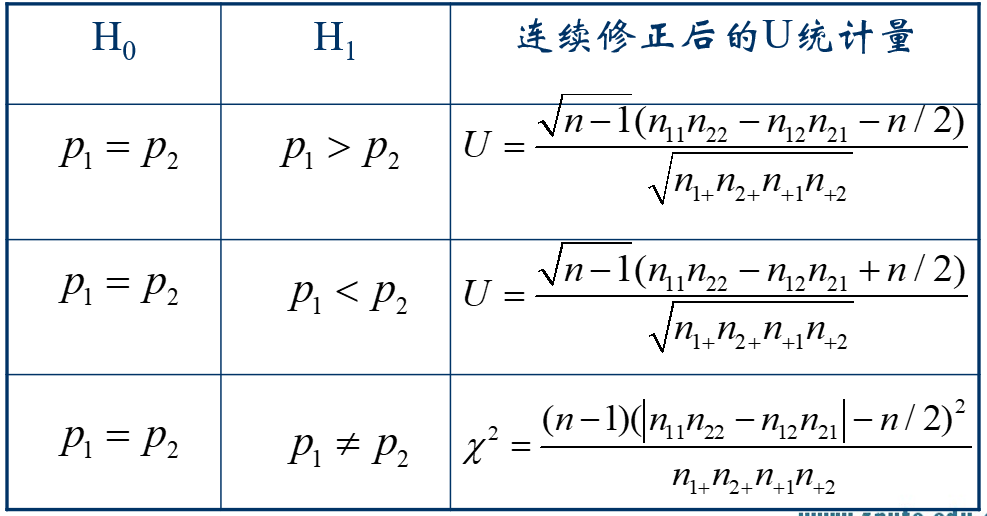{width=500px}


## 四格表的优比检验法

### 四格表的优比检验法

前面对属性数据两个比例的比较，基本上是沿着比例差的思路，得到相应的检验统计量。

除了比例差的方法外，比例的比也是一种对两个比例比较的有效度量。.

当两个比例均靠近0时，比例差的比较可能会产生误导。

如：比例0.01和比例0.001的差与比例0.41和0.401差值相等，都是0.009。但前一个差值更显著。

若计算比例的比值，这时就会避免以上问题；

第一组比例的比值为：0.01/0.001=10

第二组比例的比值为：0.41/0.401=1.02

### 几个概念

1、相对风险：是指在四格表中，两组数据之间某一属性（如成功）的比例（概率）的比值。
\[{\rm{Relative \  Risk = }}\frac{{{\pi _1}}}{{{\pi _2}}}\]

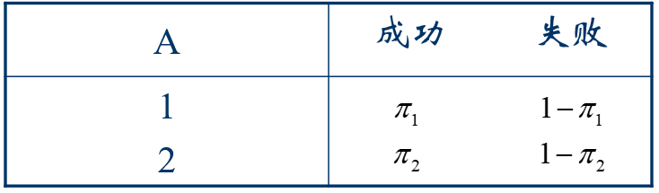{width=500px}

### 几个概念

2、优势：对于成功的概率$\pi$，成功的优势(odds)定义为：
\[{\rm{odds = }}\frac{\pi }{{1 - \pi }}\]

表示成功的可能性是失败的多少倍；
称为成功比失败的优势；

或按照四格表的一般式，其含义为：

第一行：当有属性A时，有属性B比没有属性B的优势；

第二行：当没有属性A时，有属性B比没有属性B的优势；

已知优势可以计算出“成功”、“有属性B”的概率：
\[\pi {\rm{ = }}\frac{{{\rm{odds}}}}{{1 + {\rm{odds}}}}\]

### 几个概念

3、优势比：在四格表中，第一行成功的优势与第二行成功的优势的比值

\[\theta {\rm{ = }}\frac{{odds1}}{{odds2}} = \frac{{{\pi _1}/(1 - {\pi
_1})}}{{{\pi _2}/(1 - {\pi _2})}}\]

优势比的性质：

优势比是一个非负实数；

当优势比=1时，说明两个属性相互独立，有$\pi_{1}=\pi_{2}$或 $p_1=p_2$ ；

当优势比>1时，第一行(试验)“成功”的优势大于第二行(试验)，且前者是后者的 $\theta$ 倍，有$\pi_{1}>\pi_{2}$或 $p_1>p_2$.

### 优势比的性质

当优势比<1时，第一行比第二行更不容易“成功”，有$\pi_{1}<\pi_{2}$或 $p_1<p_2$

$\theta$值在给定方向离1越远，代表两个属性间的关联性越强；

如：优势比=4比优势比=2有更强的关联性；

再如：优势比=0.25比优势比=0.5有更强的关联性；当一个$\theta$值是另一个的倒数时，它们具有相同的关联程度，只是方向相反。

如：当$\theta$=0.25时说明第1行成功的优势是第2行的1/4倍；反过来，第2行成功的优势是第1行成功的优势的4倍。故行或列的排列顺序不影响关联程度。

### 优势比的性质

当用联合概率表示$\theta$时，称为交叉积比例
\[\theta  = \frac{{{\pi _{11}}/{\pi _{12}}}}{{{\pi _{21}}/{\pi _{22}}}} = \frac{{{\pi _{11}}{\pi _{22}}}}{{{\pi _{12}}{\pi _{21}}}}\]

当两个属性独立时，有 $\theta$ =1，则：
\[{\pi _{11}}{\pi _{22}} = {\pi _{12}}{\pi _{21}}\]
该形式即为四格表独立性的第三种表达形式，同理，如果用样本优势比来表示时，有：
\[{p_{11}}{p_{22}} = {p_{12}}{p_{21}}\]

### 优势比的性质

样本优势比等于各行样本优势的比.
 
\[\hat \theta  = \frac{{{p_1}/(1 - {p_1})}}{{{p_2}/(1 - {p_2})}} =
\frac{{{p_{11}}/{p_{12}}}}{{{p_{21}}/{p_{22}}}} =
\frac{{{p_{11}}{p_{22}}}}{{{p_{12}}{p_{21}}}}\]
\[ \Rightarrow \hat \theta  =
\frac{{{n_{11}}/n/{n_{22}}/n}}{{{n_{12}}/n/{n_{21}}/n}} =
\frac{{{n_{11}}{n_{22}}}}{{{n_{12}}{n_{21}}}}\]

当两个变量相互独立时，有  $\hat \theta  = 1$  ，等价地有：
\[{p_{11}}{p_{22}} = {p_{12}}{p_{21}} \Leftrightarrow {n_{11}}{n_{22}} =
{n_{12}}{n_{21}}\]

### 优势比与相对风险的联系

当 $p1$ 和 $p2$ 都接近于0时，优势比和相对风险取值相近。

\[odds = \frac{{{p_1}/(1 - {p_1})}}{{{p_2}/(1 - {p_2})}} = Relative \ Risk \times \frac{{1 - {p_2}}}{{1 - {p_1}}}\]

### 优势比与对数优势比的推断

在样本容量不是充分大的情况下，优势比的样本分布通常有强烈的偏倚性；

为此优势比的统计推断使用对数优势比；

此时，独立性对应于：当 $\theta$ =1时，ln $\theta$ =0；故对数优势比关于0对称；

颠倒行或列的排列顺序仅改变对数优势比的符号，

两个对数优势比除符号外相同时表相同的关联程度。

如：ln(2)=0.7和ln(0.5)=-0.7，代表了相同的关联程度。

### 四格表的优比检验法

基于优势比的性质，四格表的检验可以转化为优比 $\theta$ 的检验问题。

已知样本优势比  $\hat \theta$  的抽样分布为：
\[\sqrt n (\ln \hat \theta  - \ln \theta ) \sim N(0,\frac{1}{{{p_{11}}}} + \frac{1}{{{p_{12}}}} + \frac{1}{{{p_{21}}}} + \frac{1}{{{p_{22}}}})\]

在原假设 $\theta$ =1成立时，将其标准化后有：
\[U = \frac{{\ln \hat \theta }}{{\sqrt {\frac{1}{{{n_{11}}}} +
\frac{1}{{{n_{12}}}} + \frac{1}{{{n_{21}}}} + \frac{1}{{{n_{22}}}}} }} \sim N(0,1)\]
\[{\chi ^2} = {U^2} = \frac{{{{(\ln \hat \theta )}^2}}}{{\frac{1}{{{n_{11}}}} +
\frac{1}{{{n_{12}}}} + \frac{1}{{{n_{21}}}} + \frac{1}{{{n_{22}}}}}} \sim {\chi
^2}(1)\]

### 四格表的优比检验法

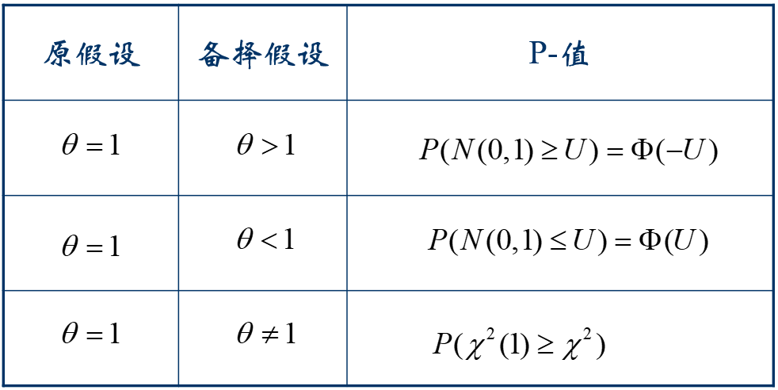{width=500px}

### 四格表的优比检验法

例3.8: 用优比检验法检验例3.1
\[{H_0}:\theta  = 1, {H_1}:\theta  > 1\]
\[\hat \theta  = \frac{{{n_{11}}{n_{22}}}}{{{n_{12}}{n_{21}}}} =
\frac{{6011}}{{323}} = 6.875,a = \frac{1}{{60}} + \frac{1}{{32}} + \frac{1}{3} +
\frac{1}{{11}} = 0.472\]
\[U = \frac{{\ln \hat \theta }}{{\sqrt a }} = 2.81\]
\[p = \Phi (-U) = 0.0025\]

### 边缘齐性检验

用于当四格表的两种属性相互不独立(相关)时；

边缘齐性检验就是检验边缘概率是否相等。

【例3.9】

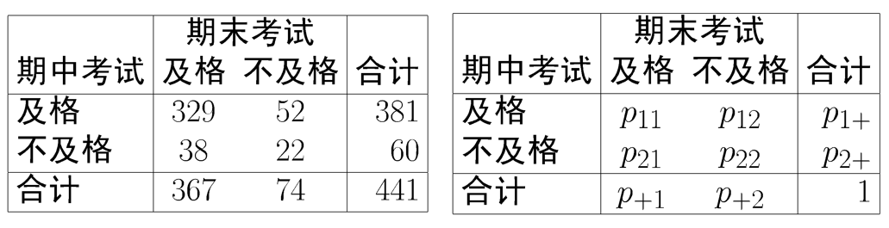{width=500px}

### 边缘齐性检验

此类问题的原假设应为:
$$H_{0}:p_{1+}=p_{+1}$$

当原假设成立时，可以得出：
\[{p_{1 + }} = {p_{ + 1}} \to {p_{12}} = {p_{1 + }} - {p_{11}} = {p_{ + 1}} - {p_{11}} = {p_{21}}\]
此时，称四格表有对称性。故对四格表而言边缘齐性检验和对称性检验等价。

边缘齐性检验的卡方统计量：
\[{\chi ^2} = \sum {\sum {\frac{{{{({n_{ij}} - n{{\hat p}_{ij}})}^2}}}{{n{{\hat
p}_{ij}}}}} }  = \frac{{{{({n_{12}} - {n_{21}})}^2}}}{{{n_{12}} +
{n_{21}}}} \sim {\chi ^2}(1)\]

### 边缘齐性检验

按照ML估计法得到 $p_{ij}$ 的估计值，代入卡方统计量即得上式。
\[{{\hat p}_{11}} = {n_{11}}/n,{{\hat p}_{22}} = {n_{22}}/n\]
\[{{\hat p}_{12}} = {{\hat p}_{21}} = ({n_{12}} + {n_{21}})/2n\]

将这一卡方检验特称为McNemar $\chi^{2}$ 检验

似然比统计量：
\[{G^2} =  - 2\ln \Lambda  =  - 2\sum {\sum {{n_{ij}}\ln (\frac{{n{{\hat
p}_{ij}}}}{{{n_{ij}}}})} } \]
\[ =  - 2\left( {{n_{12}}\ln \frac{{{n_{12}} + {n_{21}}}}{{2{n_{12}}}} +
{n_{21}}\ln \frac{{{n_{12}} + {n_{21}}}}{{2{n_{21}}}}} \right)\]

### 边缘齐性检验

经计算前例的统计量值和 $P$ 值分别为：

\[{\chi ^2} = \frac{{{{(52 - 38)}^2}}}{{52 + 38}} = 2.1778\]
\[p = P({\chi ^2}(1) \ge 2.1778) = 0.1400\]
\[{G^2} =  - 2\left( {52\ln \frac{{52 + 38}}{{252}} + 38\ln \frac{{52 +
38}}{{238}}} \right) = 2.1866\]
\[p = P({\chi ^2}(1) \ge 2.1866) = 0.1392\]
